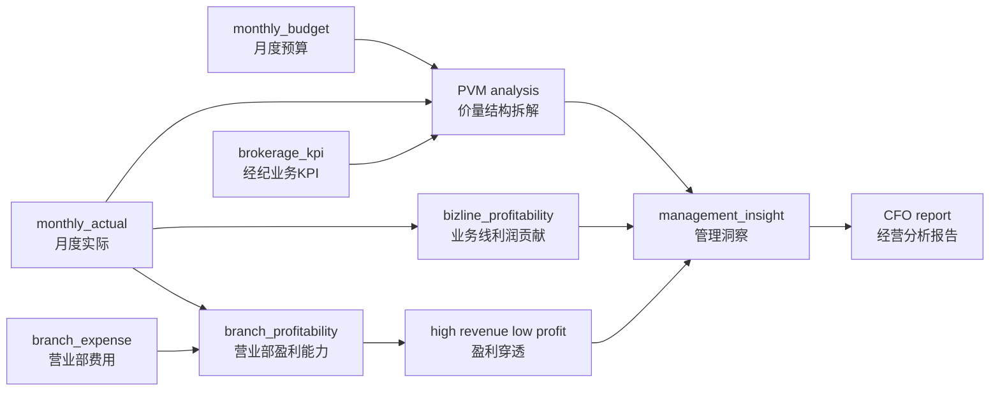
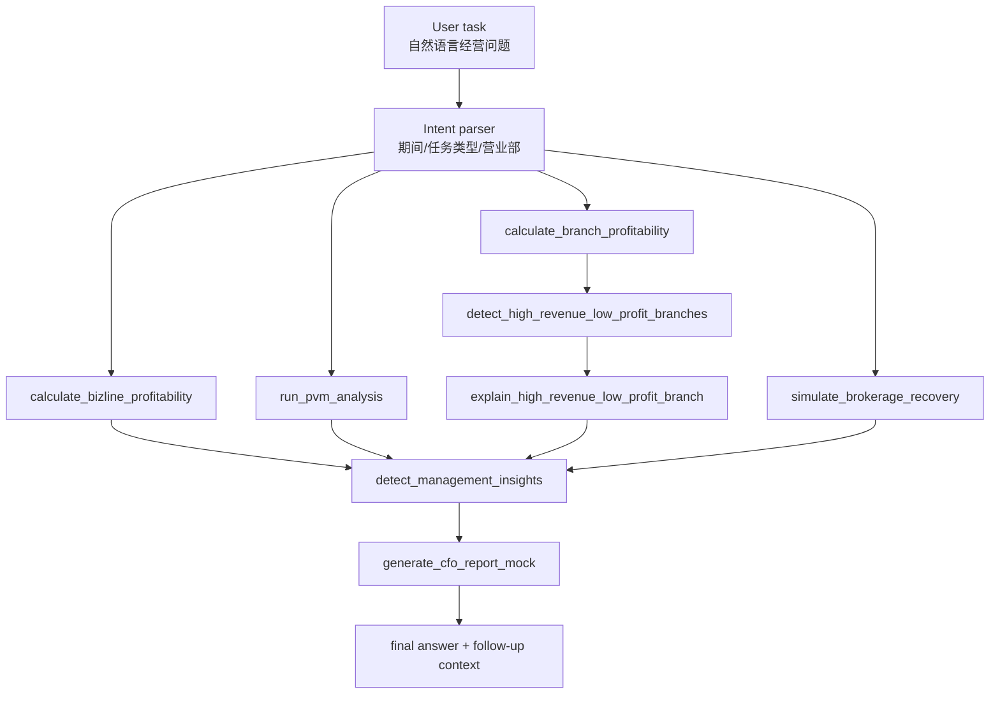

# Securities Management Accounting Agent

> 面向证券公司 CFO 月度经营分析的管理会计 Agent，自动完成“业务线利润贡献 → 经纪业务 PVM → 营业部盈利穿透 → What-if 模拟 → 经营报告生成”的分析链路。


[](https://github.com/emmadong521-beep/securities-management-accounting-agent/actions/workflows/tests.yml)


<!-- After deploying to Streamlit Community Cloud, replace the placeholder URL below. -->
<!-- [](https://your-app-name.streamlit.app) -->

## Demo

Demo GIF placeholder: add `docs/assets/demo.gif` after recording a 30–60 second walkthrough.

Recommended screenshots are documented in [`docs/assets/README.md`](docs/assets/README.md):

- `cfo_dashboard.png`
- `pvm_waterfall.png`
- `branch_profitability.png`
- `what_if.png`
- `agent_workbench.png`

## Key Metrics

| Metric | Value |
|---|---:|
| Monthly budget rows | 1,944 |
| Monthly actual rows | 1,944 |
| Brokerage KPI rows | 324 |
| Branch profitability rows | 9 |
| Bizline profitability rows | 7 |
| PVM analysis rows | 1,296 |
| Business lines | 7 |
| Branches | 9 |
| Management insight rows | 4 |
| Supported analysis scenarios | 5 |
| Agent tool-call steps per demo task | 2–7 |
| Unit tests | 31 passed |
| Data quality status | PASS |

## Quick Demo Path

1. Start Streamlit: `PORT=8502 ./scripts/run_demo.sh`.
2. Open **Agent Workbench**.
3. Run sample task: `请分析 2025-09 公司利润低于预算的主要原因。`
4. Review PVM → branch profitability → high-revenue-low-profit insights.
5. Run What-if: `如果经纪业务交易量恢复 5%，收入和利润能改善多少？`

## Online Demo

The project can be deployed to Streamlit Community Cloud in deterministic mode without API keys.

Deployment guide:

- [Streamlit Deployment](docs/STREAMLIT_DEPLOYMENT.md)

After deployment, replace the placeholder Streamlit badge with the deployed app URL.

## Project Documentation

- [Design Decisions](docs/DESIGN_DECISIONS.md)
- [Testing and Quality](docs/TESTING_AND_QUALITY.md)
- [Capability Boundary](docs/CAPABILITY_BOUNDARY.md)
- [Demo Recording Guide](docs/DEMO_RECORDING_GUIDE.md)
- [Streamlit Deployment](docs/STREAMLIT_DEPLOYMENT.md)
- [Changelog](CHANGELOG.md)

## Architecture

### Data Flow



### Agent Tool Path



## Business Scope

This PoC simulates management accounting analysis for a securities company across business lines, branches, customer segments, and product types.

It covers:

- Business-line profit contribution after allocated expense.
- Brokerage budget-vs-actual variance and PVM decomposition.
- Branch profitability ranking and high-revenue low-profit drilldown.
- What-if simulation for brokerage volume, commission-rate, and expense assumptions.
- CFO-style monthly operating report generation.

All detailed budget, actual, branch, customer-segment, product, KPI, and insight data is synthetic. Public audit-report figures are used only for aggregate-scale calibration.

## Run Locally

```bash
python3.11 -m venv .venv
.venv/bin/python -m pip install -e .
.venv/bin/python -m src.seed_data
.venv/bin/python -m src.db
.venv/bin/python -m pytest
.venv/bin/streamlit run src/app.py
```

One-command local launch:

```bash
./scripts/run_demo.sh
```

## Deterministic Agent Mode + Optional LLM Enhancement

Management accounting calculations must be reproducible and traceable. This project uses a hybrid design:

- Deterministic code handles profitability, PVM, What-if, allocation, and ranking calculations.
- LLM enhancement is optional and is used only for task understanding, plan wording, conclusion organization, and follow-up responses.
- If LLM configuration is missing or unavailable, the system falls back to deterministic mode.

## Agent Workbench

The Agent workbench is designed around visible tool orchestration rather than opaque text generation.

It displays:

- User task
- Generated plan
- Tool-call trace
- Observations
- Business conclusion
- Follow-up response

The core tools include:

- `calculate_bizline_profitability`
- `run_brokerage_budget_variance`
- `run_pvm_analysis`
- `calculate_branch_profitability`
- `detect_high_revenue_low_profit_branches`
- `explain_high_revenue_low_profit_branch`
- `simulate_brokerage_recovery`
- `detect_management_insights`
- `generate_cfo_report_mock`

## Optional Validated Data From Project One

The app can run independently with synthetic data, or read validated outputs from project one:

```bash
RECON_PROJECT_OUTPUT_DIR=/path/to/securities-month-end-recon-agent/data/output
USE_RECON_VALIDATED_DATA=false
```

When `USE_RECON_VALIDATED_DATA=true` and the configured directory contains `validated_actual_revenue.csv` and `validated_allocated_expense.csv`, the app shows project-one validated data as the active source.

If files are missing, it automatically falls back to project-two synthetic data.

## High-Revenue Low-Profit Analysis

`src/profitability_insights.py` calculates:

- revenue
- revenue rank
- operating profit
- operating margin
- margin rank
- allocated expense
- allocated expense ratio
- customer mix summary
- average commission rate
- trade volume
- rank gap

Reason tags include:

- `HIGH_SYSTEM_COST`
- `LOW_COMMISSION_RATE`
- `HIGH_INSTITUTION_CLIENT_RATIO`
- `HIGH_MARKETING_EXPENSE`
- `HIGH_HQ_ALLOCATION`
- `LOW_OPERATING_MARGIN`

## What-if Simulation

`src/what_if.py` uses the brokerage revenue formula:

```text
brokerage commission revenue = trade volume × average commission rate
```

Example:

```python
simulate_brokerage_recovery(
    period="2025-09",
    trade_volume_change_pct=0.05,
    commission_rate_change_bp=0.0,
    expense_change_pct=0.0,
)
```

The function returns base and simulated trade volume, commission rate, revenue, expense, revenue impact, and profit impact. All calculations are local code outputs.

## Volcengine Ark LLM Integration

Copy the environment template:

```bash
cp .env.example .env
```

Configure `.env`:

```bash
LLM_ENABLED=true
LLM_PROVIDER=volcengine
ARK_API_KEY=your_ark_api_key_here
ARK_BASE_URL=https://ark.cn-beijing.volces.com/api/coding/v3
ARK_MODEL=your_model_or_endpoint_id_here
LLM_TEMPERATURE=0.2
LLM_TIMEOUT_SECONDS=60
```

Notes:

- `ARK_MODEL` should be replaced with the actual Model ID from the Volcengine Ark console.
- Do not commit `.env`; it is ignored by `.gitignore`.
- If the key or model is not configured, the app automatically uses deterministic mode.
- LLM is used for task understanding and natural-language expression only. Profitability, PVM, What-if, insights, and amount calculations remain local code outputs.

## Engineering Quality

CI workflow: [`.github/workflows/tests.yml`](.github/workflows/tests.yml)

Local commands:

```bash
python -m pytest -q
python -m pytest --cov=src --cov-report=term-missing --cov-report=html
python -m src.data_quality
make ci
```

Engineering docs:

- [Design Decisions](docs/DESIGN_DECISIONS.md)
- [Testing and Quality](docs/TESTING_AND_QUALITY.md)

## Data Quality

```bash
.venv/bin/python -m src.data_quality
```

Outputs:

- `data/output/data_quality_report.md`
- `data/output/data_quality_report.json`

The report covers:

- row counts
- primary-key uniqueness
- foreign-key integrity
- amount null checks
- budget-vs-actual dimensional consistency
- profitability checks
- PVM identity checks
- seeded operating story detection
- public aggregate calibration
- final `PASS / WARNING / FAIL` status

## Core Tables

- `chart_of_accounts`
- `biz_line_master`
- `branch_master`
- `customer_segment_master`
- `product_master`
- `monthly_budget`
- `monthly_actual`
- `brokerage_kpi`
- `branch_expense`
- `branch_profitability`
- `bizline_profitability`
- `pvm_analysis_result`
- `management_insight`
- `market_benchmark`

## Seeded Demo Stories

- Brokerage revenue below budget due to lower market trading volume and lower institutional commission rate.
- A high-revenue branch shows lower operating margin after IT and headquarters expense allocation.
- Wealth-management revenue grows while marketing incentive expense grows faster.
- Margin-financing interest income under budget due to lower margin balance.
- Some branches look strong on revenue but weaker after allocated expenses.

## Future Extensions

- Deepen the mapping between project-one validated month-end outputs and project-two management accounting dimensions.
- Add relationship manager, channel, IB project, and product-level profitability views.
- Add richer LLM explanations while preserving local deterministic amount calculation.
