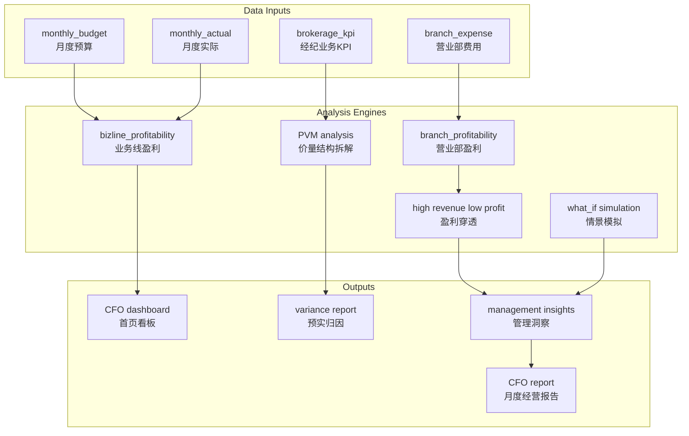
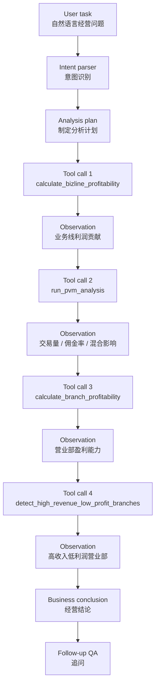

# Securities Management Accounting Agent

> **一句话定位**：面向证券公司 CFO 月度经营分析的管理会计 Agent，基于 PVM 多维拆解、业务线盈利分析和营业部盈利穿透，自动生成结构化经营分析报告与管理建议。


[](https://github.com/emmadong521-beep/securities-management-accounting-agent/actions/workflows/tests.yml)


<!-- After deploying to Streamlit Community Cloud, replace the placeholder URL below. -->
<!-- [](https://your-app-name.streamlit.app) -->

中文名：**证券公司管理会计多维经营分析 Agent**

---

## Demo

Demo GIF placeholder: add `docs/assets/demo.gif` after recording a 30–60 second walkthrough.

Recommended screenshots are documented in [`docs/assets/README.md`](docs/assets/README.md):

- `cfo_dashboard.png`
- `pvm_waterfall.png`
- `branch_profitability.png`
- `what_if.png`
- `agent_workbench.png`

---

## Key Metrics

| Metric | Value |
|---|---:|
| Monthly budget rows | 1,944 |
| Monthly actual rows | 1,944 |
| Brokerage KPI rows | 324 |
| Branch profitability rows | 9 |
| Bizline profitability rows | 7 |
| PVM analysis rows | 1,296 |
| Core business lines | 6 |
| Supporting line | 1 |
| Branches | 9 |
| Management insight rows | 4 |
| Supported analysis scenarios | 5 |
| Agent tool-call steps per demo task | 2–7 |
| Unit tests | 31 passed |
| Data quality status | PASS |

> Note: all detailed operating records are synthetic. Metrics describe the current PoC dataset and seeded analysis scenarios, not production system performance.

---

## Online Demo

The project can be deployed to Streamlit Community Cloud in deterministic mode without API keys.

Deployment guide:

- [Streamlit Deployment](docs/STREAMLIT_DEPLOYMENT.md)

After deployment, replace the placeholder Streamlit badge with the deployed app URL.

---

## Project Documentation

- [Design Decisions](docs/DESIGN_DECISIONS.md)
- [Testing and Quality](docs/TESTING_AND_QUALITY.md)
- [Capability Boundary](docs/CAPABILITY_BOUNDARY.md)
- [Demo Recording Guide](docs/DEMO_RECORDING_GUIDE.md)
- [Streamlit Deployment](docs/STREAMLIT_DEPLOYMENT.md)
- [Changelog](CHANGELOG.md)

---

## Business Architecture

### CFO Operating Analysis Flow



### Agent Workflow



---

## Core Design Principle

### “Code Calculates, LLM Explains”

Management accounting calculations must be reproducible and traceable. This project uses a hybrid architecture:

| Task | Implementation | Reason |
|---|---|---|
| PVM decomposition | Deterministic code | Volume, rate, and mix effects must be auditable |
| Business-line profitability | Deterministic code | Revenue, cost, allocation, and margin calculations must be reproducible |
| Branch profitability ranking | Deterministic code | Ranking and margin comparison should be explainable |
| High-revenue low-profit detection | Rules and deterministic scoring | Cause tags need to be inspectable |
| What-if simulation | Deterministic formula | Scenario outputs must be derived from explicit assumptions |
| Task understanding | Optional LLM | Natural language improves usability |
| Plan wording and business conclusion | Optional LLM | LLM is useful for expression, not for financial calculation |

The LLM never acts as the source of truth for financial numbers.  
It only helps interpret tasks, organize conclusions, and respond to follow-up questions based on deterministic tool outputs.

---

## Business Scope

This PoC simulates management accounting analysis for a securities company across business lines, branches, customer segments, and product types.

It covers:

- Business-line profit contribution after allocated expense.
- Brokerage budget-vs-actual variance analysis.
- Brokerage PVM decomposition.
- Branch profitability ranking.
- High-revenue low-profit branch detection.
- What-if simulation for brokerage trading volume, commission rate, and expense assumptions.
- CFO-style monthly operating report generation.

Core business lines include:

- Brokerage
- Investment banking
- Asset management
- Proprietary trading
- Margin financing
- Wealth management

A supporting management line is also included for headquarters / shared management allocation logic.

All detailed budget, actual, branch, customer-segment, product, KPI, and insight data is synthetic. Public audit-report figures are used only for aggregate-scale calibration.

---

## Capability Compared With Manual Operating Analysis

| Dimension | Common manual process | This project |
|---|---|---|
| Workflow | Pull data, build pivots, write explanations, prepare reports | Natural-language task triggers tool-based analysis flow |
| Analysis output | Reports and manual commentary | Structured conclusion, key drivers, and suggested actions |
| Dimensions | Depends on prepared templates and analyst selection | Prebuilt business line, branch, customer segment, and product dimensions |
| Variance method | Often experience-driven | PVM decomposition: volume effect, rate effect, and mix effect |
| Follow-up analysis | Requires another round of data lookup and explanation | Agent workbench supports context-based follow-up questions |
| Scenario analysis | Often requires separate spreadsheet modeling | Formula-based local What-if simulation |

---

## Quick Demo Path

1. Start Streamlit: `PORT=8502 ./scripts/run_demo.sh`.
2. Open **CFO Dashboard** to review revenue, operating profit, brokerage variance, and management insight count.
3. Open **Business Line Profitability** to compare revenue scale and allocated-profit contribution.
4. Open **Brokerage PVM Analysis** to inspect volume, commission-rate, and mix effects.
5. Open **Branch Profitability** to identify high-revenue low-profit branches.
6. Open **What-if Simulation** to test trading volume, commission rate, and expense assumptions.
7. Open **Agent Workbench** and run a natural-language task.
8. Export a CFO-style operating analysis report to `data/output/`.

Sample task:

```text
请分析 2025-09 公司利润低于预算的主要原因。
```

Sample What-if task:

```text
如果经纪业务交易量恢复 5%，收入和利润能改善多少？
```

---

## Agent Workbench

The Agent workbench is designed around visible tool orchestration rather than opaque text generation.

It displays:

- User task
- Generated plan
- Tool-call trace
- Observations
- Business conclusion
- Follow-up response

Core tools include:

- `calculate_bizline_profitability`
- `run_brokerage_budget_variance`
- `run_pvm_analysis`
- `calculate_branch_profitability`
- `detect_high_revenue_low_profit_branches`
- `explain_high_revenue_low_profit_branch`
- `simulate_brokerage_recovery`
- `detect_management_insights`
- `generate_cfo_report_mock`
- `export_cfo_report`

---

## Example Natural Language Tasks

```text
请分析 2025-09 公司利润低于预算的主要原因。
```

```text
经纪业务收入低于预算，是交易量下降还是佣金率下降导致？
```

```text
为什么深圳营业部收入排名靠前，但经营利润率偏低？
```

```text
如果经纪业务交易量恢复 5%，收入和利润能改善多少？
```

```text
请生成 2025-09 的 CFO 月度经营分析报告。
```

---

## PVM Analysis Methodology

Brokerage commission revenue is modeled as:

```text
brokerage commission revenue = trade volume × average commission rate
```

Variance decomposition:

```text
total variance = volume effect + rate effect + mix effect

volume effect = (actual volume - budget volume) × budget commission rate
rate effect = budget volume × (actual commission rate - budget commission rate)
mix effect = total variance - volume effect - rate effect
```

The current PVM analysis is available at the following grain:

```text
period × branch_id × customer_segment × product_type
```

This allows the analysis to answer questions such as:

- Which branch drove the negative brokerage variance?
- Was the variance mainly caused by lower trading volume or lower commission rate?
- Which customer segment or product type contributed most to the variance?

---

## High-Revenue Low-Profit Analysis

`src/profitability_insights.py` identifies branches that rank high on revenue but relatively low on operating margin after allocated expenses.

The analysis considers:

- revenue
- revenue rank
- operating profit
- operating margin
- margin rank
- allocated expense
- allocated expense ratio
- customer mix summary
- average commission rate
- trade volume
- rank gap

Reason tags include:

| Tag | Business Meaning |
|---|---|
| `HIGH_SYSTEM_COST` | IT system cost allocation is relatively high |
| `LOW_COMMISSION_RATE` | Average commission rate is below benchmark |
| `HIGH_INSTITUTION_CLIENT_RATIO` | Institutional client mix is high, often with stronger pricing power |
| `HIGH_MARKETING_EXPENSE` | Marketing or incentive expense is relatively high |
| `HIGH_HQ_ALLOCATION` | Headquarters allocation is relatively high |
| `LOW_OPERATING_MARGIN` | Operating margin is lower than expected |

The goal is not only to rank branches by revenue, but to identify whether revenue quality remains strong after cost allocation.

---

## What-if Simulation

`src/what_if.py` supports formula-based scenario simulation for brokerage business.

Example:

```python
simulate_brokerage_recovery(
    period="2025-09",
    trade_volume_change_pct=0.05,
    commission_rate_change_bp=0.0,
    expense_change_pct=0.0,
)
```

The output includes:

- base trade volume
- simulated trade volume
- base commission rate
- simulated commission rate
- base revenue
- simulated revenue
- revenue impact
- base expense
- simulated expense
- profit impact
- explanation

All numerical outputs are calculated by local code. LLM is used only to organize the explanation.

---

## Seeded Operating Stories

| Scenario | Description |
|---|---|
| Brokerage revenue below budget | Lower market trading volume and lower institutional commission rate |
| High-revenue low-profit branch | Strong revenue but weaker margin after IT and headquarters allocation |
| Wealth management revenue growth | Revenue increases but marketing incentive expense grows faster |
| Margin financing below budget | Interest income is lower due to reduced margin balance |
| Branch profitability divergence | Some branches look strong on revenue but weaker after allocated expenses |

---

## Optional Validated Data From Project One

The app can run independently with synthetic data, or read validated outputs from the month-end reconciliation project:

- [Securities Month-End Reconciliation Agent](https://github.com/emmadong521-beep/securities-month-end-recon-agent)

Configuration:

```bash
RECON_PROJECT_OUTPUT_DIR=/path/to/securities-month-end-recon-agent/data/output
USE_RECON_VALIDATED_DATA=false
```

When `USE_RECON_VALIDATED_DATA=true` and the configured directory contains validated outputs, the app can read:

- `validated_actual_revenue.csv`
- `validated_allocated_expense.csv`

If files are missing, it automatically falls back to project-two synthetic data.

---

## Run Locally

### Environment Setup

```bash
python3.11 -m venv .venv
source .venv/bin/activate
python -m pip install -e .
```

### Start Demo

```bash
./scripts/run_demo.sh
```

Or run manually:

```bash
python -m src.seed_data
python -m src.db
python -m pytest
streamlit run src/app.py
```

---

## Volcengine Ark LLM Integration

The system works without an LLM provider. If no API key is configured, it uses deterministic mode.

Optional LLM configuration:

```bash
LLM_ENABLED=true
LLM_PROVIDER=volcengine
ARK_API_KEY=your_ark_api_key_here
ARK_BASE_URL=https://ark.cn-beijing.volces.com/api/coding/v3
ARK_MODEL=your_model_or_endpoint_id_here
LLM_TEMPERATURE=0.2
LLM_TIMEOUT_SECONDS=60
```

Notes:

- Do not commit `.env`.
- `ARK_MODEL` should be replaced with the actual Model ID from the Volcengine Ark console.
- LLM output is never used as the source of financial calculation.
- Profitability, PVM, branch ranking, insight detection, What-if simulation, and report data are generated by deterministic code.

---

## Engineering Quality

CI workflow:

- [`.github/workflows/tests.yml`](.github/workflows/tests.yml)

Local commands:

```bash
python -m pytest -q
python -m pytest --cov=src --cov-report=term-missing --cov-report=html
python -m src.data_quality
make ci
```

Engineering docs:

- [Design Decisions](docs/DESIGN_DECISIONS.md)
- [Testing and Quality](docs/TESTING_AND_QUALITY.md)
- [Capability Boundary](docs/CAPABILITY_BOUNDARY.md)

---

## Data Quality

```bash
python -m src.data_quality
```

Outputs:

- `data/output/data_quality_report.md`
- `data/output/data_quality_report.json`

The data quality report covers:

- row counts
- primary-key uniqueness
- foreign-key integrity
- amount null checks
- budget-vs-actual dimensional consistency
- profitability checks
- PVM identity checks
- seeded operating story detection
- public aggregate calibration
- final `PASS / WARNING / FAIL` status

---

## Core Tables

| Table | Purpose |
|---|---|
| `chart_of_accounts` | Securities finance chart of accounts |
| `biz_line_master` | Business line master data |
| `branch_master` | Branch master data |
| `customer_segment_master` | Customer segment master data |
| `product_master` | Product master data |
| `monthly_budget` | Monthly budget facts |
| `monthly_actual` | Monthly actual facts |
| `brokerage_kpi` | Brokerage KPI facts |
| `branch_expense` | Branch expense facts |
| `branch_profitability` | Branch profitability result |
| `bizline_profitability` | Business-line profitability result |
| `pvm_analysis_result` | PVM analysis result |
| `management_insight` | Management insight records |
| `market_benchmark` | Market benchmark data |

---

## Project Structure

```text
securities-management-accounting-agent/
├── data/
│   ├── raw/
│   └── output/
├── docs/
├── scripts/
│   └── run_demo.sh
├── src/
│   ├── seed_data.py
│   ├── db.py
│   ├── agent.py
│   ├── profitability_insights.py
│   ├── what_if.py
│   ├── data_quality.py
│   ├── load_audit_report.py
│   └── app.py
├── tests/
├── .env.example
├── pyproject.toml
└── README.md
```

---

## Future Extensions

- Add investment banking project-level profitability analysis.
- Add relationship manager, channel, and product-level profitability views.
- Add net capital usage and ROI-style analysis.
- Add proprietary trading fair-value movement attribution.
- Add optional LangGraph implementation for more complex tool-routing experiments.
- Add online deployment after final demo assets are prepared.

---

## Disclaimer

This project is a research-oriented PoC. It uses public disclosures only for aggregate-scale calibration, and all detailed data is synthetic.

It does not represent any real securities company's internal customers, budgets, trades, vouchers, branches, accounting entries, or operating records. It does not contain non-public material information, customer private data, or commercial secrets. It is not investment advice.
